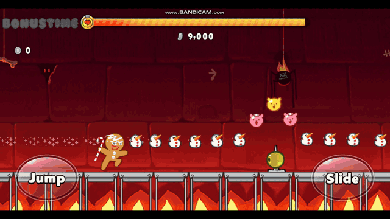
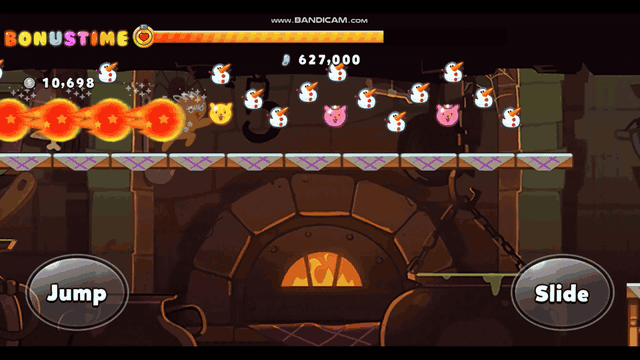
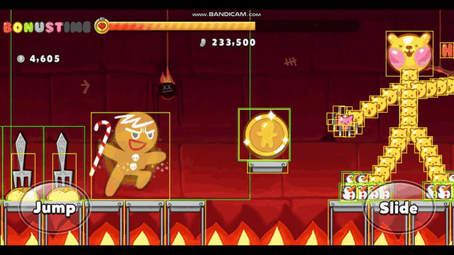
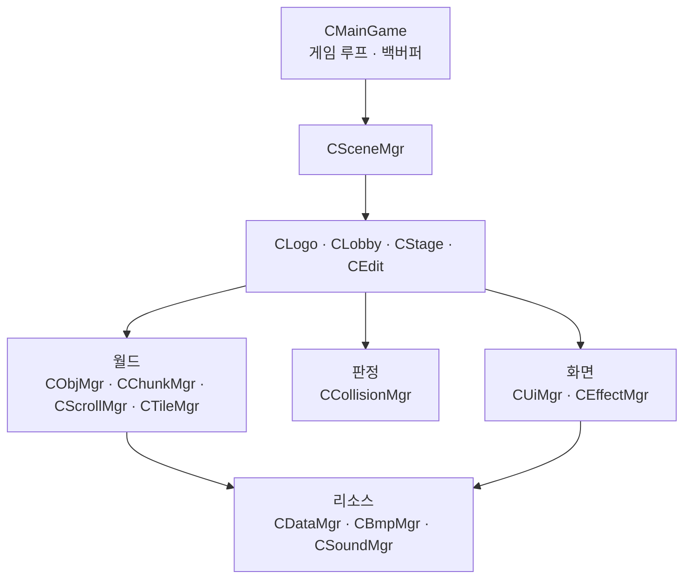
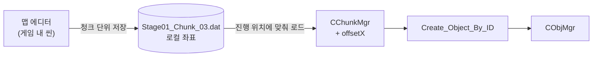
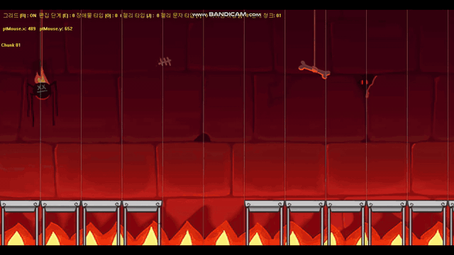
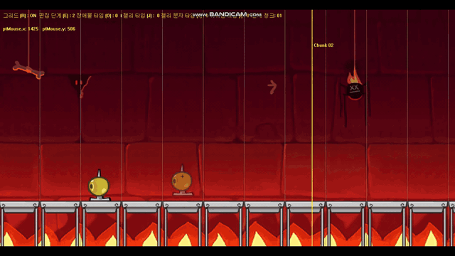
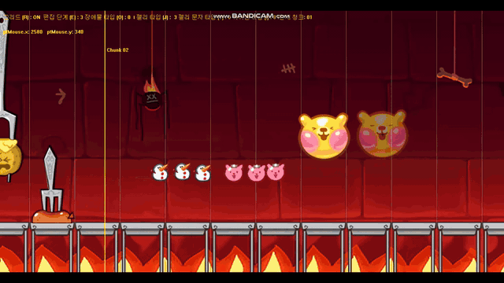
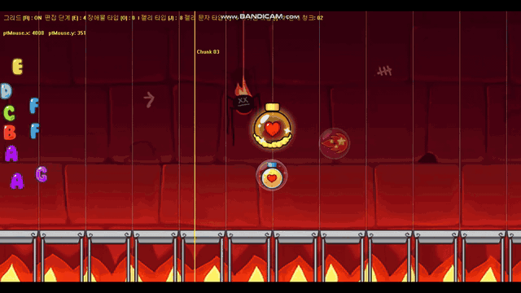
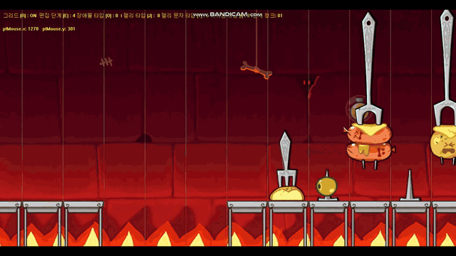

# WinAPI_2D_GameProject

**엔진 없이 C++ · Win32 API(GDI)로 만든 2D 러너 게임과 인게임 맵 에디터**

[개요](#개요) · [하이라이트](#하이라이트) · [설계 및 구조](#설계-및-구조) · [기술 스택](#기술-스택) · [주요 구현](#주요-구현) · [트러블 슈팅](#트러블-슈팅)

---

## 개요

「쿠키런: 오븐브레이크」를 모작한 2D 러너입니다. 게임 루프 · 렌더링 · 애니메이션 · 충돌 · 사운드를 직접 구현하고, 맵을 만들기 위한 **에디터 → 청크 파일 → 스트리밍** 파이프라인까지 설계했습니다.

| | |
| --- | --- |
| 기간 | 2025.10.27 ~ 2025.11.07 (약 2주) |
| 인원 | 개인 |
| 규모 | 스테이지 2 · 아이템 6종 · 플레이어 상태 17개 · 오브젝트 데이터 85종 |

---

## 하이라이트

<table>
  <tr>
    <td width="50%"><br/><sub><b>Stage 1</b> — 청크 단위로 이어지는 맵, 젤리 수집, 2층 발판, 장애물</sub></td>
    <td width="50%"><br/><sub><b>Stage 2 · 부스트</b> — 스테이지 전환 후 부스트 가속과 잔상</sub></td>
  </tr>
  <tr>
    <td colspan="2" align="center"><br/><sub><b>아이템</b> — 거대화로 장애물 파괴 → 장애물을 코인 격자로 변환 → 자석으로 젤리 흡수</sub></td>
  </tr>
</table>

---

## 설계 및 구조

### 계층



- 매니저는 모두 **싱글톤**, 생성 · 해제 순서는 `CMainGame`이 관리
- 씬은 공통 인터페이스(`Initialize` · `Update` · `Late_Update` · `Render` · `Release`)를 구현하고, `CSceneMgr`가 현재 씬 하나만 소유
- **게임(`CStage`)과 맵 에디터(`CEdit`)가 같은 매니저 · 데이터 · 팩토리를 공유** — 에디터에 보이는 오브젝트가 게임에서 그대로 생성됨

### 오브젝트

```
CObj            위치 · 렌더 박스 · 히트박스 · 애니메이션 프레임
├── CPlayer     상태 머신 (17개 상태)
├── CTile       발판 (1층 / 2층)
├── CObstacle   장애물
├── CJelly      젤리 · 코인 · 알파벳
├── CItem       (추상) Apply_Effect(CPlayer*)
│   └── CEnergy · CBoost · CGiant ...
└── CUi         CButton · CHpBar · CScore · CBonusTime
```

### 한 프레임의 흐름

| 단계 | 하는 일 |
| --- | --- |
| **Update** | 오브젝트 · UI · 이펙트 갱신 → 충돌 판정 → 다음 청크 미리 불러오기 |
| **Late_Update** | 애니메이션 진행 · 모션 전환 · 카메라 추적 → 렌더 목록 구성 → 스크롤 정수 스냅 |
| **Render** | 배경 타일 → 오브젝트(레이어별 Y 정렬) → 이펙트 → UI → 백버퍼 `BitBlt` |

Update · Late_Update는 **1/60초 고정 간격**으로 돌고, 화면 밖 오브젝트는 세 단계 모두 건너뜁니다.

---

## 기술 스택

**언어 · 플랫폼**
- `C++17`
- `Win32 API` — 메시지 루프, 키 입력, 고해상도 타이머

**렌더링**
- `GDI` — 메모리 DC 더블 버퍼링, `BitBlt`, `AlphaBlend`
- `GDI+` — PNG를 프리멀티플라이드 ARGB DIB로 변환
- 스프라이트 시트 애니메이션 (행 = 모션, 열 = 프레임)

**게임 시스템**
- 고정 시간 간격 게임 루프
- 청크 스트리밍 · 화면 밖 컬링
- 러너용 착지 판정 · 모션별 히트박스
- 상태 머신 플레이어

**설계**
- 싱글톤 매니저 · 씬 인터페이스
- 템플릿 팩토리 (`CAbstractFactory<T>`)
- 데이터 주도 생성 (프레임 키 → 이미지 · 크기 · 히트박스)

**데이터**
- 직접 설계한 청크 바이너리 포맷
- 타입 안전 직렬화 (`static_assert(is_trivially_copyable)`)

**사운드**
- `FMOD Core` — 용도별 채널, 로드 캐시

---

## 주요 구현

### 1. 맵 제작 파이프라인 — 에디터 → 청크 파일 → 스트리밍



맵을 **배경 이미지 1장 너비 = 청크 하나**로 나눠 만들고, 플레이 중에 필요한 청크만 불러옵니다.

#### 맵 에디터

<table>
  <tr>
    <td width="50%"></td>
    <td width="50%"></td>
  </tr>
  <tr>
    <td><sub><b>발판</b> — 1층 바닥은 미리 깔아 두고 클릭으로 켜고 끄는 방식. 2층 발판은 커서 위치에 반투명 미리보기로 확인 후 배치</sub></td>
    <td><sub><b>장애물 · 청크 경계</b> — 노란 선이 청크 경계. 저장하면 <b>현재 화면의 청크만</b> <code>Stage0N_Chunk_NN.dat</code>로 저장</sub></td>
  </tr>
  <tr>
    <td></td>
    <td></td>
  </tr>
  <tr>
    <td><sub><b>젤리 · 코인 · 알파벳</b> — 편집 단계와 종류를 키로 순환. 같은 자리 중복 배치 방지</sub></td>
    <td><sub><b>아이템</b> — 게임과 같은 팩토리로 생성되어 에디터에서 보이는 그대로 게임에 등장</sub></td>
  </tr>
  <tr>
    <td></td>
    <td><sub><b>스테이지 전환</b> — 배경 · 발판 · 장애물 이미지 세트와 청크 파일 이름이 스테이지 번호를 따라감</sub></td>
  </tr>
</table>

#### 청크 포맷과 좌표

```
magic 'CHNK' · version · chunkIndex · worldStartX · stageKey     ← 헤더
[ OBJID · INFO(위치·렌더 크기·히트박스) · frameKey ] × N          ← 레코드, EOF까지
```

에디터는 **청크 시작점을 뺀 로컬 좌표**로 저장하고, 게임은 **현재 월드 끝 위치를 더해** 배치합니다. 청크가 월드 어디에 놓일지 몰라도 그대로 이어 붙일 수 있습니다.

```cpp
// 저장 — CEdit::Save_Chunk_Data (요약)
if ((objX < chunkStartX) || (objX >= chunkEndX)) continue;   // 현재 청크 범위만
localInfo.fX -= chunkStartX;                                  // 월드 → 로컬

// 로드 — CChunkMgr::LoadChunkInternal (요약)
if (meta.magic != 0x4B4E4843) return false;                   // 'CHNK'가 아니면 거부
tInfo.fX += offsetX;                                          // 로컬 → 월드
CObjMgr::Get_Instance()->Add_Object(eID, Create_Object_By_ID(eID, tInfo.fX, tInfo.fY, pImageData));
```

#### 스트리밍과 컬링

- `월드 끝 - 배경 폭 × 0.9`를 지나면 다음 청크를 미리 로드
- 배경은 하나의 타일로 보고 **화면에 걸치는 타일만** 계산해 그림
- 화면 좌우 400px 여유 밖의 오브젝트는 갱신 · 렌더 생략

```cpp
// CObjMgr::Is_Culling
float fScreenX = pObj->Get_Info()->fX + fScrollX;
return (fScreenX < -fObjHalfSizeX - fBuffer) || (fScreenX > WINCX + fObjHalfSizeX + fBuffer);
```

### 2. 데이터 주도 오브젝트 생성

`CDataMgr`에 **프레임 키 → 이미지 경로 · 렌더 크기 · 히트박스**를 85개 등록하고, 에디터 배치 · 청크 로드 · 런타임 생성이 모두 같은 팩토리를 거칩니다.

```cpp
// CAbstractFactory<T> (요약)
template<typename T>
static CObj* Create_Obj(float fX, float fY, const IMAGEDATA* pImageData)
{
    CObj* pObj = new T;
    pObj->Set_FrameKey(pImageData->pFrameKey.c_str());
    pObj->Set_Info(pImageData->tInfo);      // 렌더 크기 + 히트박스
    pObj->Set_Pos(fX, fY);
    pObj->Initialize();
    return pObj;
}
```

### 3. 스프라이트 애니메이션

모든 오브젝트가 `CObj`의 **프레임 구조체 하나로** 애니메이션합니다. 시간(초) 기준이라 프레임 속도와 무관하게 같은 속도로 재생됩니다.

```cpp
struct FRAME
{
    int   iStart, iEnd;           // 현재 · 마지막 프레임 (시트의 열)
    int   iMotion;                // 모션 (시트의 행)
    float frameElapsedSec;        // 누적 시간
    float frameIntervalSec;       // 프레임 간격 (초)
    float stateLockRemainSec;     // 이 시간 동안 다른 모션으로 못 바뀜
    bool  bLoop;                  // 반복 / 1회 재생
};
```

- **모션 전환** — 상태가 바뀌는 순간 행 · 프레임 수 · 간격 · 반복 여부 · **히트박스 크기**를 함께 설정
- **렌더** — 시트에서 `(프레임 × 폭, 모션 × 높이)`를 잘라 `AlphaBlend`
- **연출** — 피격 무적은 0.1초마다 알파 128로 깜박임, 거대화는 그리는 크기만 키워 같은 시트 재사용
- **상태 잠금** — 2단 점프 도입 · 착지처럼 짧은 모션이 다음 입력에 끊기지 않게 `stateLockRemainSec` 동안 유지

### 4. 플레이어 · 아이템

- 상태 17개 — `RUN` `JUMP` `DOUBLE_JUMP` `FALLING` `LANDING` `SLIDE` `HIT` `BOOST` `CLEAR` `DEAD` 등
- 스프라이트(364×364)와 판정 영역을 분리하고 모션마다 판정 크기 변경 (슬라이드 168×66, 낙하 77×144)
- 피격 시 2초 무적 + 1초 감속, 체력은 시간에 따라 감소
- 아이템은 `CItem::Apply_Effect(CPlayer*)`로 효과를 전달하고, 같은 아이템을 다시 먹으면 지속 시간 누적

| 아이템 | 효과 |
| --- | --- |
| 에너지 | 체력 회복 · 큰 에너지는 다음 스테이지로 전환 |
| 부스트 | 3초 가속 · 장애물 파괴 · 잔상 |
| 거대화 | 3초 2배 크기 · 장애물 파괴 |
| 자석 | 반경 안의 젤리 · 아이템 흡수 |
| 코인 변환 | 장애물 히트박스를 코인 격자로 분할 |
| 젤리 변환 | 기본 젤리 → 곰젤리 |

---

## 트러블 슈팅

### 1. 무한 스크롤 구조 변경 — 세그먼트 누적 → 배경 타일 반복

- **문제** — 처음에는 청크를 불러올 때마다 배경 **세그먼트(시작 위치 · 폭 · 이미지)를 목록에 쌓고**, 렌더할 때 목록 전체를 돌며 화면과 겹치는 부분을 그렸습니다. 플레이할수록 목록과 스테이지 폭이 계속 늘었고, 세그먼트 경계마다 실수 오차를 없애려는 정수 반올림을 여러 곳에 넣어야 했습니다.
- **해결** — 배경을 **하나의 타일이 반복되는 것**으로 보고, 카메라 위치에서 화면에 걸치는 타일 번호만 계산해 그리도록 바꿨습니다. 청크 로드는 월드 끝 위치만 누적하고, 스테이지별 청크 목록은 설정 하나로 관리합니다.
- **결과** — 세그먼트 목록이 사라져 배경 렌더링은 맵 길이와 무관하게 **화면 너비 + 2장**만 그림

```cpp
// CStage::Render_Background_Tiled
const int firstTileIdx = camWorldX / tileWidth;
const int tilesNeeded  = (WINCX / tileWidth) + 2;
```

### 2. 배경 타일 경계의 1px 틈

- **문제** — 배경 타일이 이어지는 경계에 세로로 가는 틈(헤어라인)이 보였습니다.
- **원인** — `BitBlt`는 정수 픽셀 단위로 복사하는데, 스크롤 값은 실수라 타일마다 반올림 결과가 달라졌습니다.
- **해결** — 스크롤 값을 매 프레임 **정수로 스냅**해 모든 타일이 같은 기준으로 그려지게 했습니다.

```cpp
// CScrollMgr::Scroll_Lock
m_fScrollX = floorf(m_fScrollX + 0.5f);
m_fScrollY = floorf(m_fScrollY + 0.5f);
```

### 3. 발판 착지 시 튐 · 모서리 걸림

- **문제** — 겹쳐 있는 발판 위에 착지하면 캐릭터가 튀거나, 발 끝이 발판 모서리에 스치기만 해도 걸렸습니다.
- **원인** — 일반 AABB 보정은 겹친 발판마다 한 번씩 보정해 여러 번 밀어 올리고, 조금만 겹쳐도 착지로 처리합니다.
- **해결** — 러너용 착지 규칙을 따로 만들었습니다.

```cpp
// CCollisionMgr::Collision_Rect (요약)
if (vy < 0.f) continue;                                      // 상승 중에는 발판 통과
for (auto& pSrc : Src)
{
    if (overlapX < 2.f)             continue;                // 모서리에 스친 경우 제외
    if (dstBottom > srcTop + 20.f)  continue;                // 발이 윗면보다 한참 아래면 제외
    if (penW <= penH)               continue;                // 세로 충돌만
    if (penH < bestPenY) { bestPenY = penH; pBestSrc = pSrc; }   // 가장 얕은 윗면 하나만
}
```

`F1`로 렌더 박스 · 히트박스를 화면에 표시하는 디버그 모드를 만들어 수치를 맞췄습니다.

### 4. 거대화 중 발이 발판 아래로 파고듦

- **문제** — 거대화로 크기가 커지는 동안 캐릭터가 발판 아래로 파고들었습니다.
- **원인** — 크기는 중심 기준으로 커지기 때문에, 커지는 만큼 아래쪽 절반이 발판 밑으로 내려갑니다.
- **해결** — 크기를 바꾸기 전후의 **발바닥 위치 차이만큼 y를 되돌려** 발 높이를 고정했습니다.

```cpp
// CPlayer::Late_Update (요약)
const float prevBottom = m_tInfo.fY + (m_tInfo.fCY * 0.5f);
m_tInfo.fCY = m_tRenderInfo.fCY * m_fCurrentScale;
const float newBottom  = m_tInfo.fY + (m_tInfo.fCY * 0.5f);
m_tInfo.fY += prevBottom - newBottom;
```

---

> 학습 목적의 개인 모작입니다. 게임 이미지 · 사운드 등 리소스의 저작권은 원작사(Devsisters)에 있습니다.
